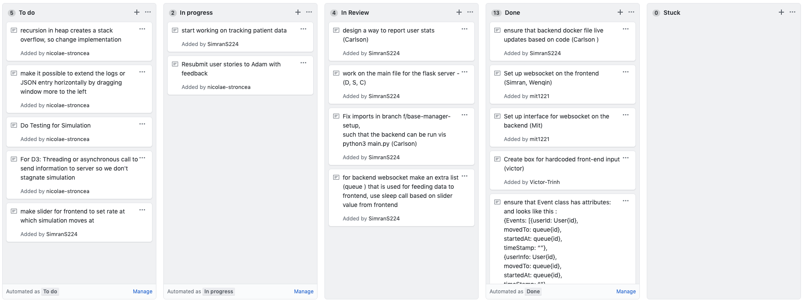

# ED-Simulation/ED-Simulation-VI

## Iteration 2

 * Start date: Friday Novemeber 1, 2019
 * End date: Wednesday November 13, 2019

----

## Process Details


#### Roles & responsibilities
**Roles**

Organizer/Lead: Simran
 * Sets deadlines for tasks
 * Organizes meetings
 * Makes sure that everyone is completing their tasks on time
 
Product Manager: Wenqin/Simran/Carlson
 * Talks with the Vector Institute and other stakeholders to determine what should be developed
 * Creates specification documents detailing what should be built
 * Sets tasks based on the specification document
 
Designer: Wenqin: Wenqin
 * Designs the user interface to make it look good
 * Tests the user interface on clients to ensure that it is usable
 
Frontend developer: Victor, Wenqin, Carlson, Simran
 * Codes the visualization using front-end frameworks such as React
 * Works with the PM(s) and backend developer(s) to develop the product
 
Backend Developer : Mit, Nicolae, Daniel, Carlson, Simran
 * Codes the algorithm behind the visualizations through a backend server
 * Works with the PM(s) and frontend developers(s) to develop the product
 
**Responsiblities**

Simran:
 * Description: Responsible for coding the backend server and the frontend user interface. Is also responsible for organizing meetings and delegating tasks to people. 
 * Strengths: Typescript, Flask, continuous deployment, software architecture  
 * Weaknesses: Indecisive, time, spelling
    
Daniel:
 * Description: Primarily responsible for backend development but can switch to frontend if more attention is required.
 * Strengths: Python, Javascript (currently learning react)
 * Weaknesses: Indecisive, project planning, knowledge of libraries and architectures
    
Wenqin:
 * Description: Responsible for frontend development and backend development, but with a focus on the frontend aspect. Additionally responsible for designing the user interface and testing the products’ final usability.
 * Strengths: Frontend development, design, problem solving
 * Weaknesses: Organization, time management, prioritization 
    
Mit:
 * Description: Responsible for backend development primarily with some involvement in frontend development.
 * Strengths: Python, large-scale projects, Django, software design, JavaScript
 * Weaknesses: Time management, organization, excessively detail-oriented
    
Carlson:
 * Description: Experienced with developing various applications and is responsible for handling issues and reviews. 
 * Strengths: NLP, Javascript, Fullstack Development, APIs
 * Weaknesses: Availability, organization
    
Victor: 
 * Description: Responsible for mocking up designs and front end development. 
 * Strengths: Python, Python Libraries, ML
 * Weaknesses: Web libraries, linear algebra, design methodologies
    
Nicolae:
 * Description: System architecture, APIs
 * Strengths: Python, Flask, software architecture, JavaScript.
 * Weaknesses: React

#### Team Rules

Our team has a relaxed and fun working culture. Everyone has their own schedule and time when they work best, so we do not care when someone works, as long as they finish their part by the agreed upon deadline. In addition, we are supportive of each other. We will try our best to help each other if anyone has questions or needs help. 

Communications:
 * In person meetings on Tuesday between 4-6pm to discuss issues and collaborate on problems
 * Video calls on Thursdays for planning and backlogs
 * We will contact the partner via email, but we may also schedule in person meetings
 * Partner is also a U of T staff member so it shouldn’t be too hard to find a time to meet on campus
 
Meetings:
 * We will use task tracking software such as Asana, github cards in order to ensure everyone knows their role
 * Anyone experiencing difficulties can contact the rest of the group during either of the weekly group meetings
 * Members are held accountable by our groups fundamental of respect and the fact that they dont want to tarnish relationships with their friends. Further Simran is repsonsible for following up with members for meetings and Wenqin is responsible for following up with members for tasks.
 
Conflict Resolution:
 * Scenario 1: Someone is busy and fails to let the group know 

* Resolution: Based on our team rules we understand that one can be busy at times but we will bring it up with them and clarify the reason for their absence. 

* Scenario 2: Someone is being belligerent. 

* Resolution: Based on our rules as defined above the person experincing the belligerent behaviour of the other person would bring it up that person if they were comfortable, if not they could talk to someone else such as Carlson who is responsible for resolving issues. In the event that Carlson is the one being belligerent one can bring it to the attention of Wenqin or Simran.

* Scenario 3: Someone feels excluded in the group.

* Resolution: We designed the team rules to create an open and friendly environment, but it is still possible that someone feels excluded in the group. To resolve such issues, we will use retrospectives where anyone can anonymously create sticky notes for things they would like to see Started, Continued and Stopped. Furthermore, the same conflict resolution path of Carlson -> Wenqin/Simran will be used to handle this issue if one feels more comfortable doing so instead. 
 
 

#### Events

 * We have planned to meet every week for at least one hour in the form of Google hangouts calls, casual in person chats, or a formal meeting at a specified location on Tuesday between 4-6pm. During the meetings, we will discuss issues and collaborate on problems requiring the attention of multiple group members. 
 * We have planned to host brief online meetings on Thursdays for planning and backlogs, further during these meetings we will divide tasks based on the current progress and updates
 * We have planned to meet with our partner on most Fridays from 4-5pm to discuss questions and demo updates and discuss with the partner via slack.
 * For coding we will have work sessions on occaions, specifically we had work sessions during reading week and during weekends. 
 * We will also be coding individually on own time, if not during work sessions
 
 
#### Partner Meetings
##### Meeting 1:
*  We met at the mining building to discuss the intial plan and requirements of the product on Friday, October 5th.

* Discussed: 
   * Workflow
   Given a list of patients
   A patient will have a time of arrival_time, acuity, and whether or not they need an x-ray (and which type of image x-ray they need). This is given as a CSV file.
   * Reception:
   The reception is when a patient first goes to the emergency room and talks to the receptionist with their problems. 
   Since reception has a limited amount of people, a queue may build up at the reception. 
   
   Queue type: priority queue
   Rule about how to insert into the queue that will be defined by the ML researcher. 
   Distribution for how long it takes for someone to be received: normal/gaussian distribution, or possibly other options
   Once received, a patient will go to triaging (most of the time)
   * Triaging: 
   Triaging is when a nurse estimates your case and puts you into a specific patient doctor queue based on how severe the acuity is 
   There will be a queue because there is a limited number of doctors
   Patient doctor interaction
   Once a patient talks to a doctor, the doctor will release or get the patient to do an x-ray
   Once a patient is assigned to a doctor, generally they should stay with the doctor (this can be made enforced or not enforced)
   * Scan: 
   X-ray (time and amount of technicans)
   mri (time and amount of technicans)
   catscan (time and amount of technicans)


Our goal is to build the graph, and we want to see how the graph changes depending on different parameters. 

Assumptions:

- Start simulation as if the patient is new and has no patients

Visualization of queues:

- Queues should be buckets with a granular view of people in the buckets

Input: list of patients defined by arrival time, acuity, x-ray, and other imaging options given in a CSV file

Final output: docker image
Priority queue should be modular where the user can define the insert and pop themselves
Doctor and patient stats

* Summary: 
  * We learned about the project and were walked through the inital plan of the meeitng and the scope of the project 
  * We also learned about other simulations and the goal of the project ie to be able to display to researchers simulations and allow them see the impact of changing certain perameters 

##### Meeting 2:
*  We met at the bahen to discuss any questions and talk about implementation details on Friday, October 12th.

* Topics that were discussed: 
  * We clarified issues pertaining to acquity, the queue functions, and how results should be saved after the simulation terminates.
  * We also discussed implementation and decided on using python for the backend so that researchers could easily modify it in the future. We also decided to use react for the frontend based on the overlapping strengths of the group members. 
  * We also went over testing methods, and requested our partner to provide a sample set of data in order to ensure proper functionality of our project.

* Summary: 
  * After first learning about the project we worked on developing questions and possible implementations and at this meeting asked those questions to Vector


##### Meeting 3:
*  We met at the bahen to discuss any questions and talk about implementation details on Friday, October 25th.

* Topics that were discussed: 
  * Frontend and backend integration: Backend sends delta data for each queue to the frontend via webhooks or web sockets. The frontend receives the data and updates the visualization of the queues.
  * We clarified column names in the csv file, how to treat additional columns on the csv, and what specific events are to be logged.
  * A tricky part of the logging is calculating mean time (actual wait time) for the queue,because you can be in multiple queues at same time.  Make sure if patient is at hospital for 2 hours, will be at most for 2 hours.

  * Test Cases:
    * Front end - max limit of objects on the graph
    * Incorrectly connected graphs
    * Distribution correctness
    * Correct statistics at end of simulation from test cases provided by client
    * Try using different queue types

* Summary: 
  * We dicussed questions regarding possible test cases, the format of the input csv file and other edge cases. We also reviewed our plan to build the backend using flask, with websocket to connect to the frontend and a react front end with d3.js animations

----

#### Deployment and Github Workflow



* Our workflow is on **Github Cards**, where we use the following sections:
    * To do
    * In progress
    * In review/Testing
    * Completed
    
We decide during our team meetings on what tasks need to get done, as well as what the priorities should be.
We rank the priorities by putting most important tasks on the top of a card with least important on the bottom.
After, we put the tasks on Github Cards, we assign them to the right person.
When starting to work on something we ensure we update the github card (ie move it to in progress),
then checkout a branch named according to what the feature we will be building in the branch  
While coding we ensure we develop not by running flask or react locally but 
through docker ie by running ```docker-compose up --build``` which starts a flask and node server (to run our web app), this ensures the changes we make will be easily integerated and execute as intended in our final docker image that we will be giving to our partner (Vector institute). 
After finishing a feature we move it to in review, in the event that we are stuck we have a location for 
that in github cards where we can move our card to 
After a task is completed we move it to in review and someone else on the team verifies it works
For communicating to each other about changes we use messenger as well as our 2 meetings during 
the week (Thursday - discuss backlog and plan/assign tasks, Tuesday - work on issues as well as integration)
After a branch is ready to be merged we request a pull request and Carlson will test it and review it before
it gets merged
Additionally everytime someone pushes to master, their code will be go through our continous integration pipline through Travis CI, note however since we do not have access yet we not been able to add this feature
For naming conventions we will follow snake_case for all python code and will use PascalCase for React components and camelCase for their instances

We choose this workflow based on early brainstorming sessions at meetings and because of the 
experiences of some of the members on our team, further this workflow of having continous integration and 
running our server through docker helps ensure that our final product is what we expect it to be 
Further we would like to highlight, based on our partner's (Vector Institute)requirements  
we do not have to deploy since our partner Vector does not want a deployed app and wants a docker image that can run locally because of user privacy concerns

## Product

#### Goals and tasks
 
 * Display interactive, draggable nodes on the screen with connections between nodes (the node configuration can be hardcoded)
   * Create a new react application
   * Find a library to display a graph structure and add it to the react app
   * Use the library to display a simple graph structure
 
 * Concurrent management of the simulation
   * Explore whether to use Multithreading, Multiprocessing, both, or something else in order to allow different elements of the system to run concurrently
   * Figure out the mechanism to use in order to communicate data between threads/processes
   * Threads within processes

 * Parse CSV data
   * Use a library (probably Pandas) to parse the uploaded CSV file from the frontend
   * Generate the necessary data structure from each row read (which represents one patient's data)
   * Figure out a way to read the file while running the simulation

 * Set up the websocket server on the backend
   * Figure out what Python library to use and read documentation for usage
   * Make a wrapper around the library functions to create an interface that other files can use
   * Do error checking for handling client disconnects
   
 * Set up websocket connection on the frontend
   * Set up a connection with the web socket server using the correct protocols and port
   * Add event handler for handling messages that the web socket server sends

 * Allow users to click on nodes and update the parameters of the node
   * Create an event handler that triggers whenever a node is clicked
   * Identify what the node is, and display an editable form for the node's settings in a sidebar
   * Process the user's inputs, and update the node's settings
   
 * Create a log viewer on the screen to see simulation events
   * Create a button to open a log viewer
   * Use websockets to recieve events from the backend
   * Display events given by the webhook on the log viewer
 
 * Docker and Travis setup
   * Create a docker file to run the flask server 
   * Create a docker file to run the frontend react web app
   * Create a docker compose file to run both the backend and frontend
   * Look into how to create our custom image, note we do not have to deploy 
   since our partner Vector does not want a deployed app and wants a docker image 
   that can run locally because of user privacy concerns
   * Email course coordinators to get access to Travis to be able to setup CI

   
#### Artifacts

1. **Pictures**. We drafted some mock-ups of the simulation before starting. This was to
develop a shared understanding with Vector on what the requirements are. Additionally, we used
this to start brainstorming on what the backend needs to do, as well as have a base-line for the minimum
needed for the front-end.


2. **Comments**: We use comments to document  various design choices, and explain the logic
behind the code, the which is especially critical when we're implementing the simulation.
Here's an example of pseudocode developed during one of team sessions:

```python
 '''
    Try to insert a patient into an available resource, if there exists one.
    Return true if patient inserted successfully.
    
    Will be false only if:
        - All resources are currently occupied
        - Doesn't pass the rule for any of the available resources
            - If a resource is available, then we know that
                - either queue is empty
                - none of the elements in the queue passed the rule for this resource, so then try the current patient
                    to see if he passes
    Will be true only ifif:
        - Patient is available, and there is a resource in the process that is available,
            and patient passes the rule for a specific resource
    '''

    def fill_spot(self, patient):

        # 1. Check: Is patient busy? If no, proceed
            # Iterate through all Resources in random order and check
            # 1. Is resource available
            # 2. If it's available, does this element pass the resource rule
            # 3. If yes, insert the patient into the specific resource(existing method
            # 4. Add the element on the heap
```

3. **Meeting Minutes**: We document all of our meetings, both internal and external with Vector.
Whenever we're not sure about something that we discussed with Vector, or some details
we decided on as a team, we can check the meeting notes. It also serves as a way to make
sure everyone is kept up to date on the development of the project, even if they missed the meeting.

[Link to Meetings Minutes](https://drive.google.com/open?id=1ftzBkQdU7P4RSA6EvPqXnF9qdQxPVwyV)

4. **CRC Cards**: We used CRC cards in order to brainstorm the design of the simulation
and the base clases that we needed for it.


### Highlights
* We initially thought about using electron for developing the product since we can create a desktop app. In the end, we chose to use python for the backend and react for the front end becuase researchers are more comfortable using python. Our partner pointed out that they would prefer a product that can be modifed and passed on to other developers in the future, and python ended up being the better option. 

