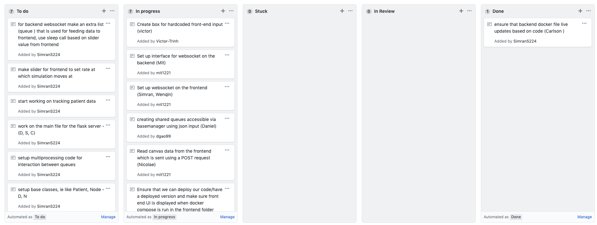

# ED-Simulation/ED-Simulation-VI

## Iteration XX - Review & Retrospect

 * When: November 13, 2019
 * Where: Bahen Centre for Information Technology

## Process - Reflection
Throughout the whole process of creating the first phase of our application, there were many things we did correctly but also a couple of things that went wrong, which are good lessons for us, moving forward.

#### Decisions we made that turned out well:

1. To make our meetings as meaningful and efficient as possible, we created a document with a list of all of our questions going into the meeting. This ensured that we didn't forget to ask about something that we needed to and that we didn't waste any time in the meeting thinking about what to ask. We also created a meeting notes document and had delegated the task of taking meeting minutes to one of the team members before each meeting. This was a good decision because if one of the team members couldn't make it to a meeting, they can easily refer to this document to get a brief summary. Furthermore, if nothing was written down from the meeting, there is a high probability that we would forget about an important detail afterwards.

Here is one of our meeting notes: https://docs.google.com/document/d/1DekoRbvQqSQ7un9vQMWB_kEwdjWPHJGxvcteECTR4Gs/edit?usp=sharing

2. Another decision that turned out well for us was organizing meetings with our partners very early on in the process. This allowed us to get all the information we needed and get all of our questions answered early to maximize the time spent working on the actual application. If we had not done so, we would be making assumptions when developing and if those assumptions turned out to be wrong, it would have been a time consuming process to redo parts of the application.

3. We used a feature in GitHub for organizing our tasks and backlog called GitHub Cards. This is a very convenient way to get a holistic picture of the current progress of our project. Because of the way we structured it, it allows us to see who is doing what tasks, their current status, what tasks are unassigned and left to be done, as well as ask for help if one of us is stuck.

Here is a screenshot of the current state of our GitHub Cards: 

4. Before doing any coding, we created a document outlining possible options that we could use for implementing different parts of our system. One such example is whether to use multithreading or not and what are the alternatives. We also summarized the workflow of the whole application to give ourselves a clear idea of the order in which things would happen in the simulation.

Here is the document: https://docs.google.com/document/d/1hfjI4DrQ9rsrOYkc0erd4Lcpl9Y7UGgjy0oEzgq8Wzo/edit?usp=sharing

#### Decisions we made that did not turn out as well as we hoped

1. We decided to have fewer "work sessions" to allow people to have more time to code on their own schedule. The problem with this is that work sessions are important to allow the frontend and backend teams to integrate each other's code. Without more work sessions, the work that the team does goes to a stall, and as a result less work gets done. A good solution to having more work sessions is determining everyone's availability and having regular work sessions when everyone is free. 

2. We decided to start coding as quickly as possible without doing very detailed planing of the software architecture. We hoped that by starting to code earlier we would more easily be able to create a software architecture and finish the project earlier. However what happened was that without a clear plan of the software architecture, our team aimlessly wrote code that did not work well with each other. What would have worked better is if we resisted the urge in the beginning to get started, and instead invest time in creating a good plan of how our software should have been built.

3. We decided to split up coding tasks in ways that that did not allow someone to work on their part individually. This results in a lot of dependencies in our code that requires people constantly working together to make progress. Again if we had developed a good software plan in the beginning we would have been able to better divide up coding tasks that would allow someone to work on their part individually without much need for other team members.

#### Planned changes

It is crucial to learn from your past mistakes and make any necessary changes to fix them to prevent them from reoccuring.

 * One change that we will be making to our process is to schedule more work sessions where we all meet together, or at some people doing the frontend and some doing the backend. This is required to allow seamless integration of the backend with the frontend without having to worry about it at the very end. Leaving it all to the end could mean wasting excess time trying to integrate the two sides instead of doing meaningful work that extends the application's features.

 * Another process-related change that we are planning to make is to write good documentation that everyone in the team can access which outlines the interface to use (i.e. what methods to call) to integrate that specific part of the application. Furthermore, since the backend will send data in a particular JSON structure to the frontend, we will also discuss that structure so that the frontend team can continue their work, knowing the correct structure that they will recieve data in.

## Product - Review

#### Goals and/or tasks that were met/completed:
 * We were able to display interactive, draggable nodes on the screen with connections between nodes. 
 * We were able to create a log viewer on the screen to display simulation events.
 * Docker setup
    * [Backend Dockerfile](../backend/Dockerfile)
    * [Frontend Dockerfile](../frontend/Dockerfile)
    * [Docker Compose](../docker-compose.yml)
 * Backend websocket server - node to view have to be in socketSetup branch for now as we continue to integrate
    * can locate by going to this location from root (backend/app/connect.py)
    * [connect.py](../backend/app/connect.py)
 * Concurrent management of the simulation
 * Parsing CSV data

#### Goals and/or tasks that were planned but not met/completed:
 * We were unable to create functionality to allow a user to edit the details of a node. This wasy mainly because there were many features that we needed to implement and this one was not a priority for this deliverable since we were focused on making sure hard coded node values worked before allowing user customizatioln.
 * Another task that we were not able to complete was setting up Travis CI because it requires authentication, which we are currently in the process of getting.
 * Although we have many independent aspects of the system working, the full integration of the different parts is not completed yet. This is because we prioritized on making the individual parts work correcly first and have not gotten to integrating all of the parts yet.

#### How was your product demo?
 * How did you prepare your demo?
 * What did you manage to demo to your partner?
 * Did your partner accept the features?
 * Were there change requests?
 * What did you learn from the demo from either a process or product perspective?

## Meeting Highlights

Going into the next iteration, our main insights are:
 * Create a solid plan of tasks before coding so that everyone knows what to do. We found that by having a good plan of
   what everyone needed to do, it reduces the need for time intensive work sessions and increases productivity as people
   can work on their part without the need for other people. 
 * Continue with regular meetings so that everyone is accountable for getting their work done. We found that by having regular    meetings team members were more engaged and less likely to procrastinate due to peer pressure. 
 * We will need to work on displaying the simulation on the frontend. At the moment the frontend only receives the events of  the simulation that
   the backend processes and does nothing useful with it. The next step should be to take the events and actually visualize the simulation on the frontend. 
   
