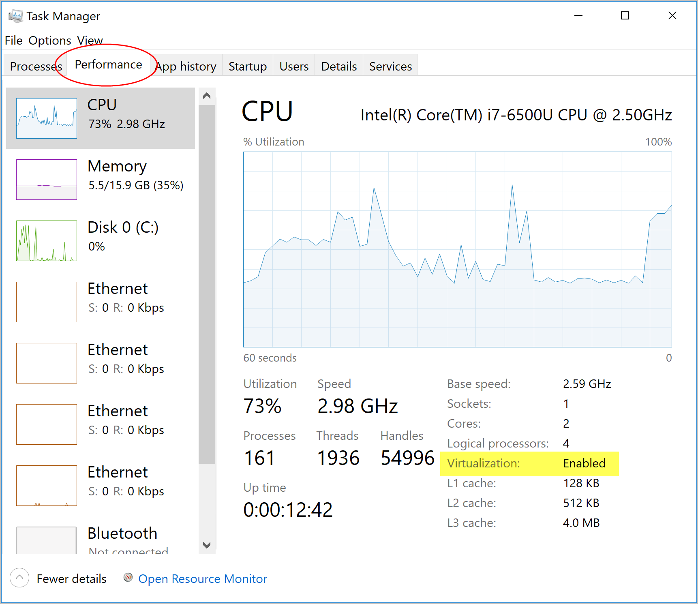

mkdocs serve --dev-addr=0.0.0.0:82# User Guide for ER | Visualizer

<!-- Use this for spacing -->
<br> 

## System Requirements for Windows

- Windows 10 64-bit: Pro, Enterprise, or Education (Build 15063 or later)
- Hyper-V and Containers Windows features must be enabled
  - This can be done by running the docker application after installing. The user will be prompted and required to restart the computer in order to finish the required setup.

- The following hardware prerequisites are required to successfully run Client Hyper-V on Windows 10:

  - 64 bit processor with [Second Level Address Translation (SLAT)](https://en.wikipedia.org/wiki/Second_Level_Address_Translation)
  - 4GB system RAM
  - BIOS-level hardware virtualization support must be enabled in the BIOS settings (see image).

   

## Installing and running Docker Desktop on Windows

- Double-click Docker Desktop Installer.exe to run the installer.

- If you haven’t already downloaded the installer (Docker Desktop Installer.exe), you can get it from Docker Hub. It typically downloads to your ```Downloads``` folder, or you can run it from the recent downloads bar at the bottom of your web browser.

- Follow the instructions on the installation wizard to accept the license, authorize the installer, and proceed with the install.

- When prompted, authorize the Docker Desktop Installer with your system password during the install process. Privileged access is needed to install networking components, links to the Docker apps, and manage the Hyper-V VMs.

- Click Finish on the setup complete dialog and launch the Docker Desktop application.

## System Requirements for Mac OS

- Mac hardware must be a 2010 or newer model, with Intel’s hardware support for memory management unit (MMU) virtualization, including Extended Page Tables (EPT) and Unrestricted Mode. You can check to see if your machine has this support by running the following command in a terminal: sysctl kern.hv_support

- macOS must be version 10.13 or newer. We recommend upgrading to the latest version of macOS.

- If you experience any issues after upgrading your macOS to version 10.15, you must install the latest version of Docker Desktop to be compatible with this version of macOS.

  Note: Docker supports Docker Desktop on the most recent versions of macOS. That is, the current release of macOS and the previous two releases. As new major versions of macOS are made generally available, Docker will stop supporting the oldest version and support the newest version of macOS (in addition to the previous two releases).

- At least 4 GB of RAM.

- VirtualBox prior to version 4.3.30 must not be installed as it is not compatible with Docker Desktop.

## Installing and running Docker Desktop on Mac
- Double-click Docker.dmg to open the installer, then drag the Docker icon to the Applications folder.

- Install Docker app

- Double-click Docker.app in the Applications folder to start Docker. (In the example below, the Applications folder is in “grid” view mode.)

  You are prompted to authorize Docker.app with your system password after you launch it. Privileged access is needed to install networking components and links to the Docker apps.

  The Docker menu in the top status bar indicates that Docker Desktop is running, and accessible from a terminal.


  If you just installed the app, you also get a message with suggested next steps and a link to the documentation. Click the Docker menu (whale
 menu) in the status bar to dismiss this pop-up notification.


- Click the Docker menu (whale menu) to see Preferences and other options.

- Select About Docker to verify that you have the latest version.

## Instructions 
### Setup: 

- Download the docker installer [here](https://www.docker.com/products/docker-desktop) and follow the docker setup instructions above. The website directs you to the correct version base on your OS
- Then, start the application by double clicking the docker icon in your Applications folder.

### Running the Application:
Run ```docker-compose down``` - in case you already have docker and have something running on the same port
Then run ```docker-compose up --build``` - to build the image/run the application
  - The client and server services will be instantiated with the ports indicated in the .env file.
  - The client can be accessed at http://localhost:5000 by default.

Note: you do not have to worry about any other setup either than ensuring you have docker on your device.

In the event that you have issues due to conflicting ports, you can change the values of the following port variables in the env file (located at the root of the repository).
```
APP_SERVER_PORT = {Backend port number - default 8000}
REACT_APP_PORT = {Frontend port number - default 5000}
DEV_ENV = development
WEB_SOCKET_PORT = {WSS port number - default 8765}
```
### Using the Application:
- Once the application begins (your terminal should look the same as the image above), go to http://localhost:5000. If you are using another port - based on REACT_APP_PORT that you have in your .env file. Then, a blank canvas will be presented where the hospital workflow can be created using different click operations.
  - Users who have used the application before may choose to upload a saved canvas file to quickly load a previously used workflow.
  - Hospital processes (e.g. reception, triage, scans) can be made by simply clicking on the plus button. The user will then be prompted to enter the necessary properties of the process.
  - Clicking a process on the screen will allow the user to view and edit its properties.
  - To specify the processes to which the patient will travel, click the "add edges" button on the top right. Then, click the outbound process followed by the inbound process.
- Once a user finishes creating the workflow, they can choose to save the layout into a file for future use, before uploading a csv file for the patient information.
- After the patient csv file is loaded, the simulation can start.
- As the simulation runs, the user can click on a process and see the number of patients currently in the queue for that process. The number of patients in each acuity will also be displayed.

## Customizing ports

The defaults for ports are indicated as such:

The backend APIs are at port 8000 indicated by APP_SERVER_PORT in the .env file.
The client host port is 5000 indicated by REACT_APP_PORT in the .env file.

The values of the ports can be customized simply by changing the value in the .env file.

This can be used to test our simulation's API to view the final statistics without having to run the frontend since our frontend limitation is that you would have to run the entire visualization before getting the resulting statistics.
This is also customizable in case the port on the user's computer is already in use by a separate application.

To switch from development to production, 

change

```
DEV_ENV=development
```

to 

```
DEV_ENV=production
```

Development environment has the following features:
- Backend:
  - Activates the debugger 
  - Activates the automatic reloader
  - Enables the debug mode on the Flask application.
- Frontend:
  - Activates hot reloading
  - Directly serves files
